## Crop Compass

  

### Overview

Crop Compass is a smart agriculture web platform designed to support farmers and verified agricultural sellers in Nepal. It combines crop recommendation, fertilizer guidance, soil data analysis, and a verified marketplace for seeds and fertilizers.

---
### Objective

To build a unified agricultural support platform that helps farmers make data-driven decisions while also providing a trusted marketplace for agricultural products in Nepal.

---

### Key Features

#### 1. Verified Agricultural Marketplace

A web-based shop where users can buy and sell seeds and fertilizers.

* Only verified sellers can list products
* Quality control system for seller approval
* Product browsing, cart system, and order management
* Secure checkout using eSewa payment integration

---

#### 2. Fertilizer Recommendation System

A smart advisory tool for nutrient management.

* Input: crop type + soil NPK values
* Output: fertilizer adjustment recommendations (increase/decrease N, P, K)
* Helps optimize yield and reduce over-fertilization

---

#### 3. Crop Recommendation System

Data-driven crop suggestion engine based on environmental and soil conditions.

* Uses soil data from NARC (Nepal Agricultural Research Council)
* Uses temperature and rainfall data from NASA datasets
* Input parameters: soil nutrients, pH, temperature, rainfall
* Output: most suitable crops for given conditions in Nepal

---

### Tech Stack

| Layer              | Technologies |
|--------------------|--------------|
| Frontend           | React, HTML, Tailwind CSS |
| Backend            | Python, Flask |
| Database           | MongoDB |
| Payment Gateway    | eSewa |
| Data Sources       | NARC Nepal soil data, NASA climate datasets |

---

### Future Improvements

* Mobile application version
* Real-time weather integration
* AI-based yield prediction
* Multi-language support for farmers

---

## Screenshots

### Shop
1. Home
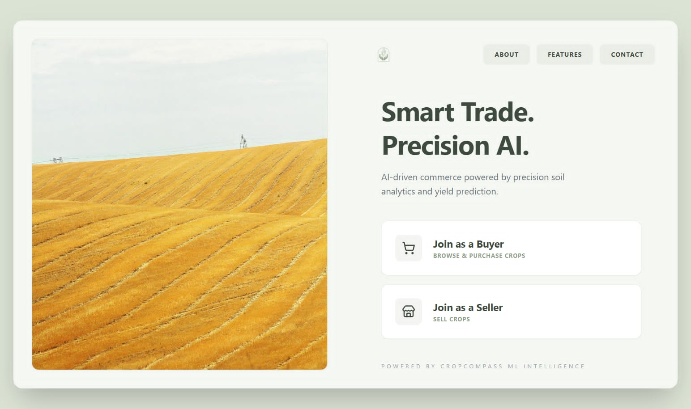
2. About
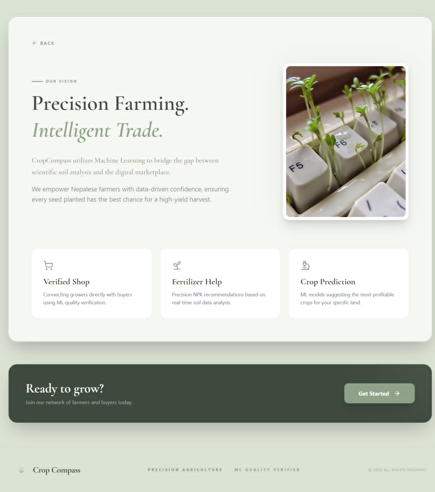
3. Contact

4. Features
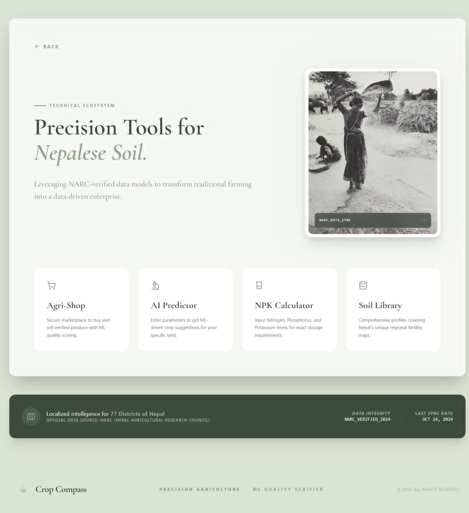
5. Signup
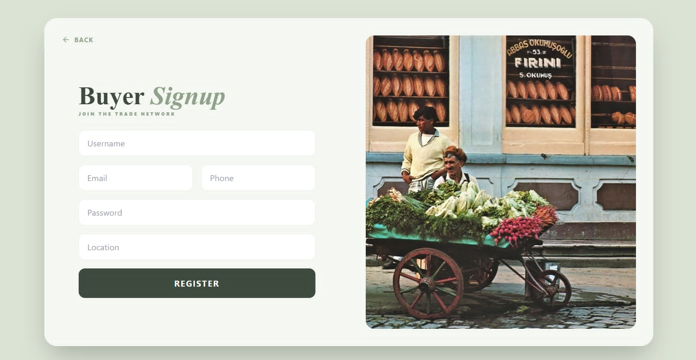
6. Login

7. Shop
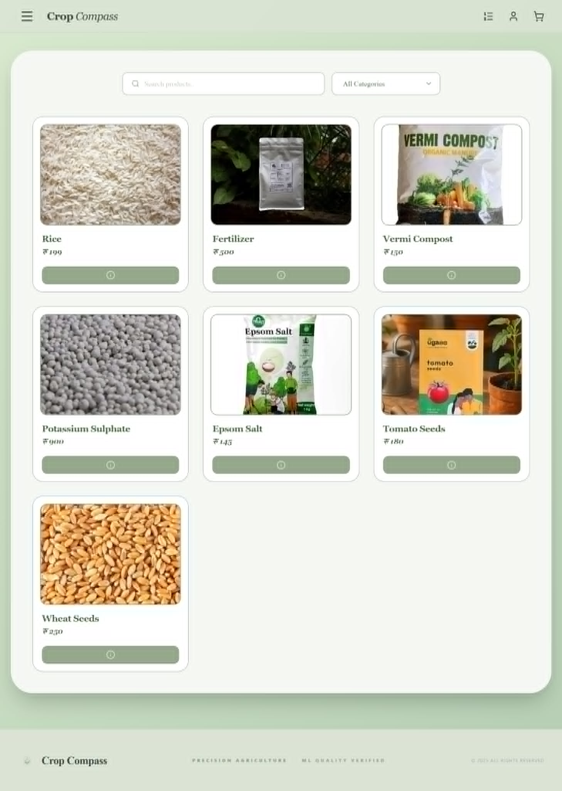
8. Seller Dashboard
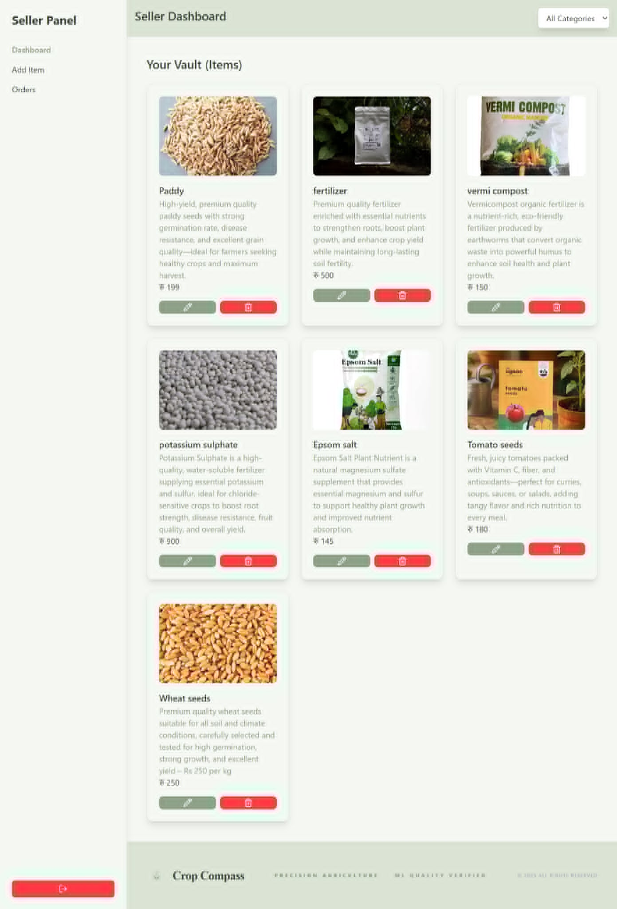
9. Product
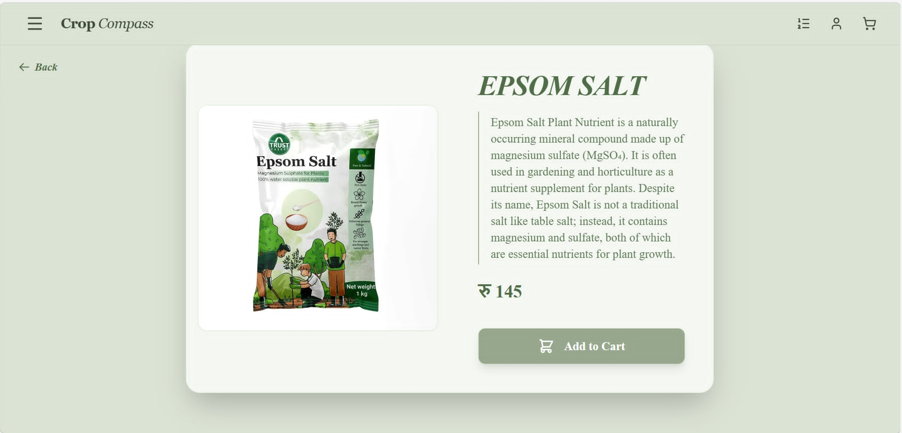
10. Add product
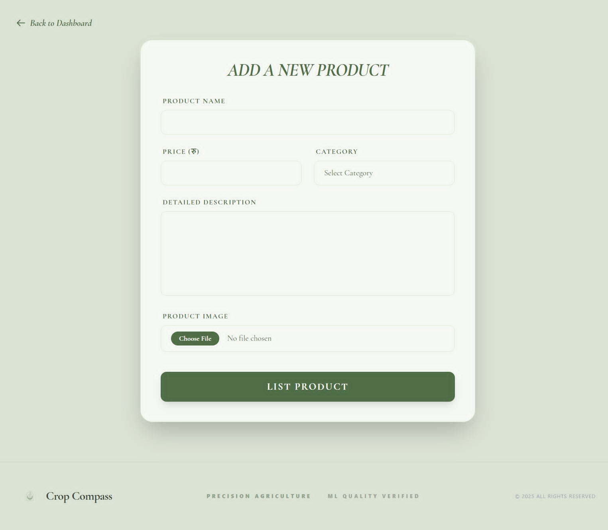
11. Edit product
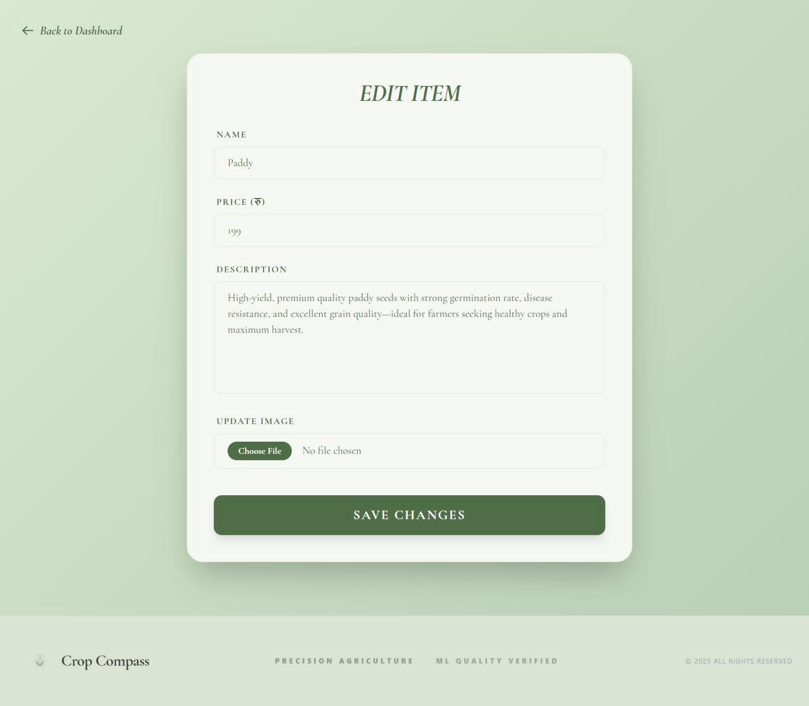
12. Cart
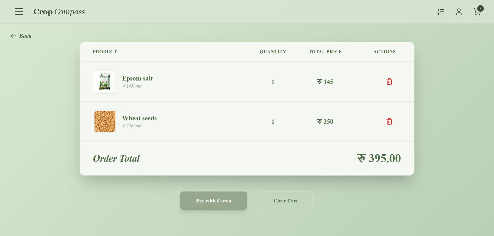
13. Payment
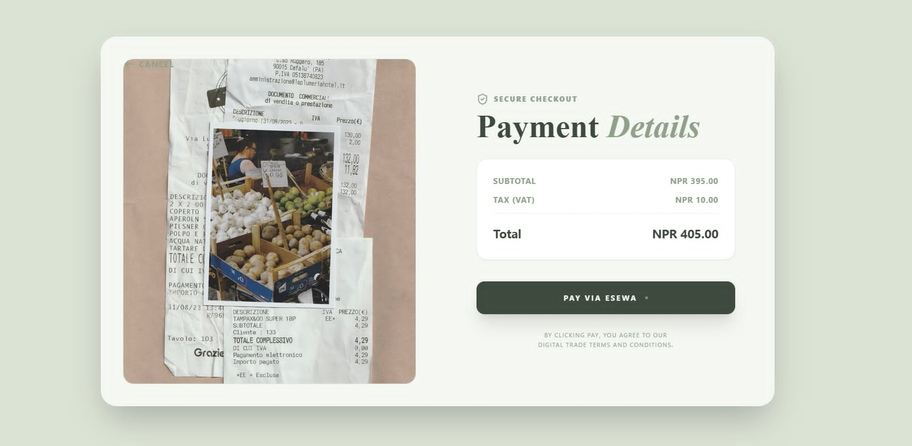
14. Esewa
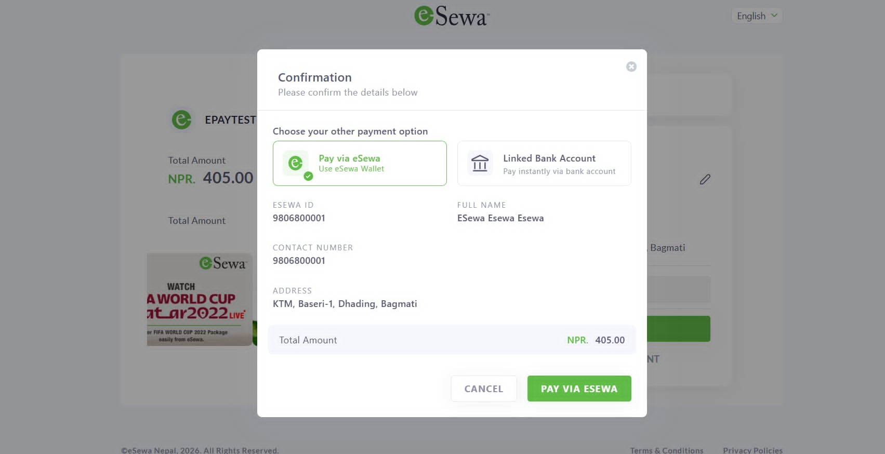

### Crop recommendation and fertilizer recommendation (Machine Learning)
1. Crop recommendation
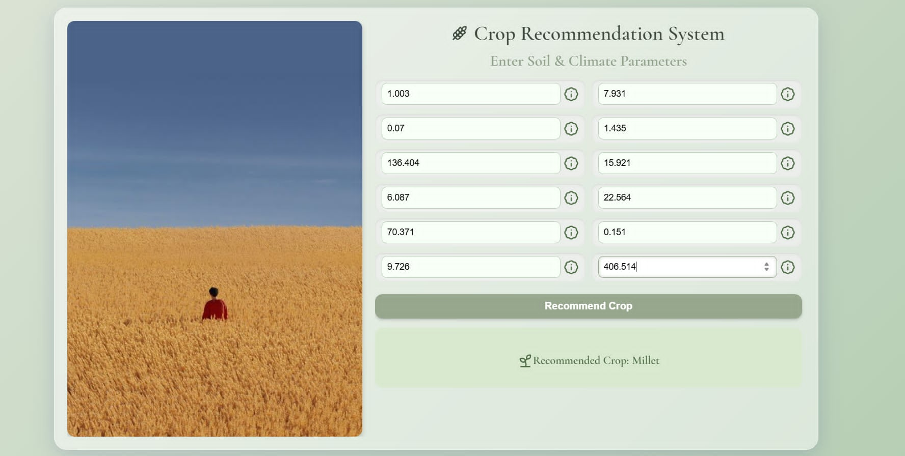
2. Fertilizer recommendation
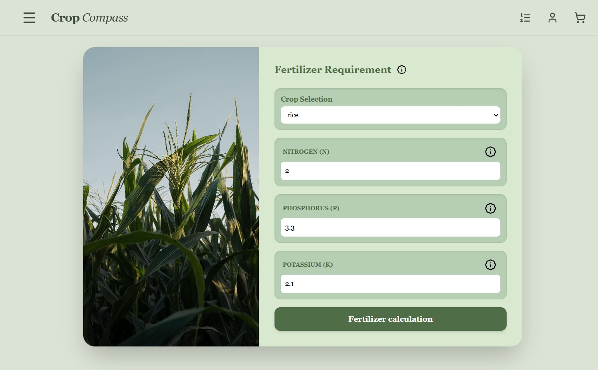
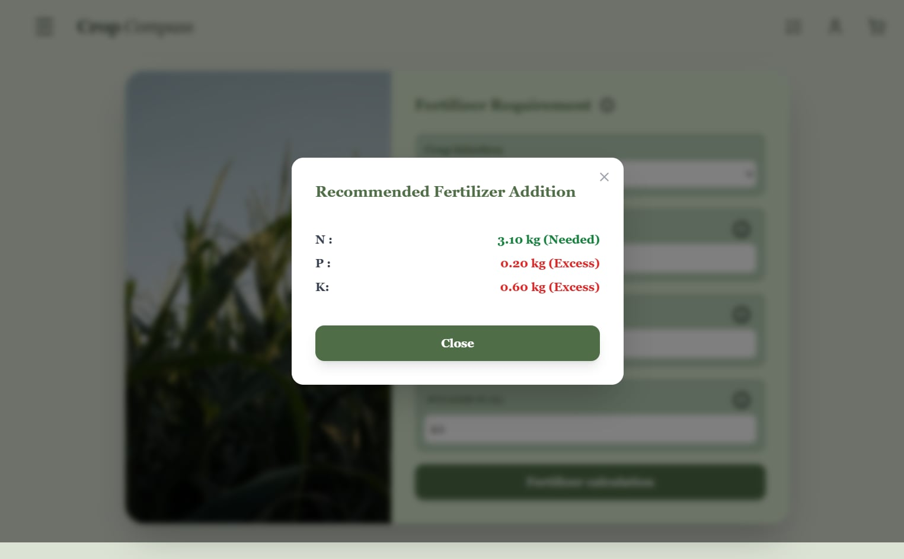